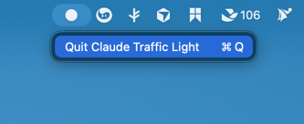

# Claude Traffic Light

macOS 菜单栏悬浮红绿灯，实时显示 Claude Code 工作状态。

- 红灯：Claude 正在工作
- 黄灯闪烁：Claude 等待用户操作（权限确认等）
- 绿灯：Claude 空闲/输出完毕

## 演示
[6b287b719cf0765930e00e8ae9936b6f.mp4](../Library/Containers/com.tencent.xinWeChat/Data/Documents/xwechat_files/wxid_7b4luvvgkrir22_c6ee/temp/RWTemp/2026-05/9e20f478899dc29eb19741386f9343c8/6b287b719cf0765930e00e8ae9936b6f.mp4)

## 安装

### 方式一：DMG 安装

1. 双击 `ClaudeTrafficLight.dmg`
2. 将 `ClaudeTrafficLight.app` 拖入 `Applications` 文件夹
3. 从 Launchpad 或 `/Applications` 启动

### 方式二：源码编译

```bash
cd ClaudeTrafficLight
./build.sh
open ClaudeTrafficLight.app
```

需要 macOS 13+ 和 Command Line Tools（`xcode-select --install`）。

## 配置 Claude Code Hooks

### 1. 复制 Hook 脚本

```bash
cp traffic-light-hook.sh ~/.claude/traffic-light-hook.sh
chmod +x ~/.claude/traffic-light-hook.sh
```

确保系统已安装 `jq`：

```bash
brew install jq
```

### 2. 配置 settings.json

编辑 `~/.claude/settings.json`，在 `hooks` 中添加以下事件：

```json
{
  "hooks": {
    "UserPromptSubmit": [
      {
        "hooks": [
          {
            "type": "command",
            "command": "~/.claude/traffic-light-hook.sh"
          }
        ]
      }
    ],
    "PreToolUse": [
      {
        "matcher": "*",
        "hooks": [
          {
            "type": "command",
            "command": "~/.claude/traffic-light-hook.sh"
          }
        ]
      }
    ],
    "PostToolUse": [
      {
        "matcher": "*",
        "hooks": [
          {
            "type": "command",
            "command": "~/.claude/traffic-light-hook.sh"
          }
        ]
      }
    ],
    "PermissionRequest": [
      {
        "matcher": "*",
        "hooks": [
          {
            "type": "command",
            "command": "~/.claude/traffic-light-hook.sh"
          }
        ]
      }
    ],
    "Stop": [
      {
        "hooks": [
          {
            "type": "command",
            "command": "~/.claude/traffic-light-hook.sh"
          }
        ]
      }
    ]
  }
}
```

如果已有其他 hooks 配置，将 traffic-light-hook 追加到对应事件的 `hooks` 数组中即可。

## 使用

1. 启动 App 后屏幕上会出现竖版红绿灯悬浮窗
2. 可拖动到任意位置（包括第二显示器）
3. 窗口始终置顶，不会被其他窗口遮挡
4. 菜单栏有一个小圆点图标，点击可退出应用
5. 窗口位置会自动记忆，下次启动恢复

## 关闭与打开

### 关闭应用

菜单栏（屏幕顶部状态栏，Wi-Fi、电池图标同一排）有一个小圆点图标（●），点击后选择「Quit Claude Traffic Light」即可退出。

由于设置了 `LSUIElement = true`，应用不会出现在 Dock 中，只能通过菜单栏操作。



如果找不到菜单栏图标，也可以命令行强制退出：

```bash
pkill ClaudeTrafficLight
```

### 打开应用

- 从 Launchpad 启动
- 从 `/Applications` 双击打开
- 命令行：`open /Applications/ClaudeTrafficLight.app`
- 未安装到 Applications 时：`open ~/ClaudeTrafficLight/ClaudeTrafficLight.app`

## 开机自启

系统设置 → 通用 → 登录项 → 点击 `+` → 选择 `ClaudeTrafficLight`

## 工作原理

```
┌─────────────────────────────────────────────────────────────────────┐
│                        Claude Code 运行时                            │
│                                                                     │
│  ┌───────────┐   ┌───────────┐   ┌───────────┐   ┌───────────┐    │
│  │UserPrompt │   │PreToolUse │   │Permission │   │   Stop    │    │
│  │  Submit   │   │/PostTool  │   │  Request  │   │           │    │
│  └─────┬─────┘   └─────┬─────┘   └─────┬─────┘   └─────┬─────┘    │
│        │               │               │               │           │
└────────┼───────────────┼───────────────┼───────────────┼───────────┘
         │               │               │               │
         ▼               ▼               ▼               ▼
┌─────────────────────────────────────────────────────────────────────┐
│                  traffic-light-hook.sh                               │
│                                                                     │
│   读取 stdin JSON → 解析 hook_event_name → 映射状态                   │
│                                                                     │
│   UserPromptSubmit ──→ "red"                                        │
│   PreToolUse/PostToolUse ──→ "red"                                  │
│   PermissionRequest ──→ "yellow"                                    │
│   Stop ──→ "green"                                                  │
│                                                                     │
└───────────────────────────────┬─────────────────────────────────────┘
                                │
                                │ 原子写入 (tmp + mv)
                                ▼
┌─────────────────────────────────────────────────────────────────────┐
│           /tmp/claude-traffic-light/state.json                       │
│                                                                     │
│   {"state":"red","session_id":"...","timestamp":...}                │
│                                                                     │
└───────────────────────────────┬─────────────────────────────────────┘
                                │
                                │ DispatchSource 文件监听 (<10ms)
                                ▼
┌─────────────────────────────────────────────────────────────────────┐
│              ClaudeTrafficLight.app                                  │
│                                                                     │
│   ┌─────────────────────┐    ┌──────────────────────────────┐      │
│   │ TrafficLightState   │    │    TrafficLightView          │      │
│   │  Manager            │───▶│                              │      │
│   │                     │    │    ┌──────┐                  │      │
│   │ 读取 JSON           │    │    │ ● RED│  ← 亮/暗         │      │
│   │ 解析 state 字段     │    │    ├──────┤                  │      │
│   │ 更新 @Published     │    │    │ ● YLW│  ← 亮(闪烁)/暗   │      │
│   │                     │    │    ├──────┤                  │      │
│   └─────────────────────┘    │    │ ● GRN│  ← 亮/暗         │      │
│                              │    └──────┘                  │      │
│                              └──────────────────────────────┘      │
│                                                                     │
│   窗口: NSPanel (置顶 / 无标题栏 / 可拖动 / 跨屏)                    │
└─────────────────────────────────────────────────────────────────────┘
```

### 状态流转图

```
         ┌──────────────────────────────────────┐
         │                                      │
         ▼          UserPromptSubmit             │
    ┌─────────┐    PreToolUse/PostToolUse   ┌───┴─────┐
    │  GREEN  │ ───────────────────────────▶ │   RED   │
    │  空闲   │                              │  工作中  │
    └─────────┘                              └────┬────┘
         ▲                                        │
         │                                        │ PermissionRequest
         │ Stop                                   │
         │                                        ▼
         │                                   ┌─────────┐
         └───────────────────────────────────│ YELLOW  │
                         Stop                │ 等待用户 │
                                             └─────────┘
```

## 状态映射

| Hook 事件 | 灯状态 | 含义 |
|-----------|--------|------|
| UserPromptSubmit | 红 | 用户提交 prompt，开始工作 |
| PreToolUse | 红 | 正在执行工具 |
| PostToolUse | 红 | 工具执行完，继续工作 |
| PermissionRequest | 黄 | 等待用户授权 |
| Stop | 绿 | 输出完毕 |

## 多 Session

同时运行多个 Claude Code 时，红绿灯跟踪最新活跃的 session（按时间戳判断）。

## 故障排查

检查状态文件是否正常写入：

```bash
cat /tmp/claude-traffic-light/state.json
```

手动测试 hook 脚本：

```bash
echo '{"hook_event_name":"Stop","session_id":"test"}' | ~/.claude/traffic-light-hook.sh
cat /tmp/claude-traffic-light/state.json
```

如果 App 卡在某个状态，手动重置：

```bash
echo '{"state":"green","session_id":"reset","timestamp":'$(date +%s)',"event":"manual","detail":""}' > /tmp/claude-traffic-light/state.json
```
# claude-traffic-light
